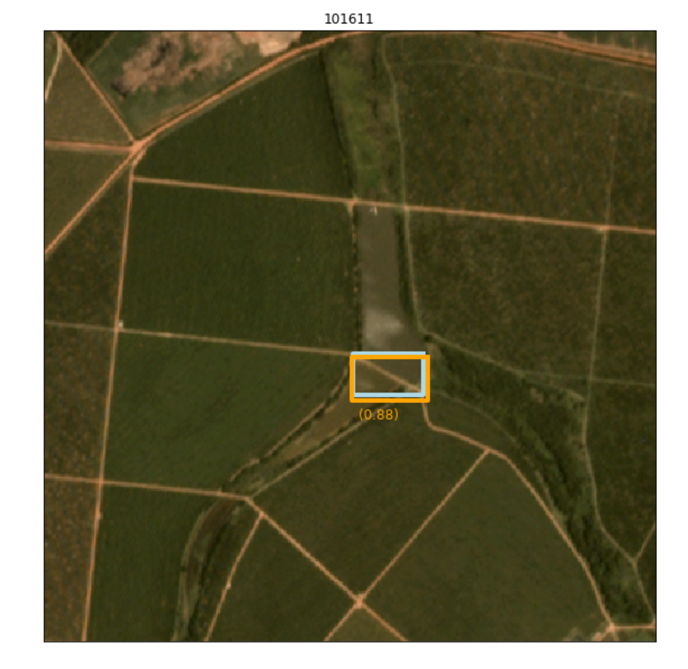
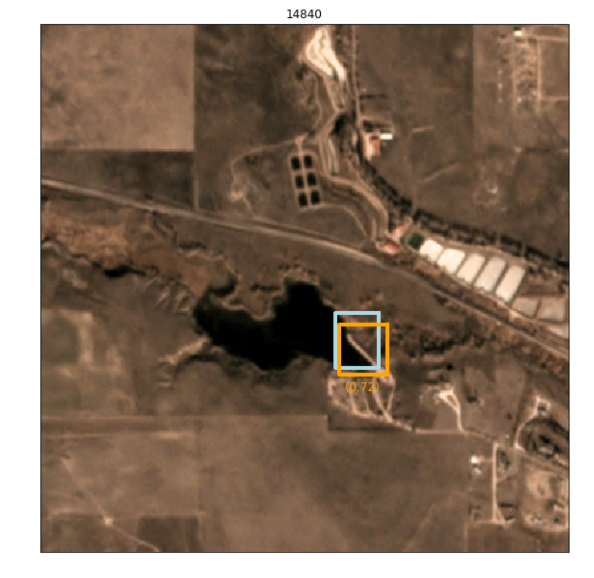
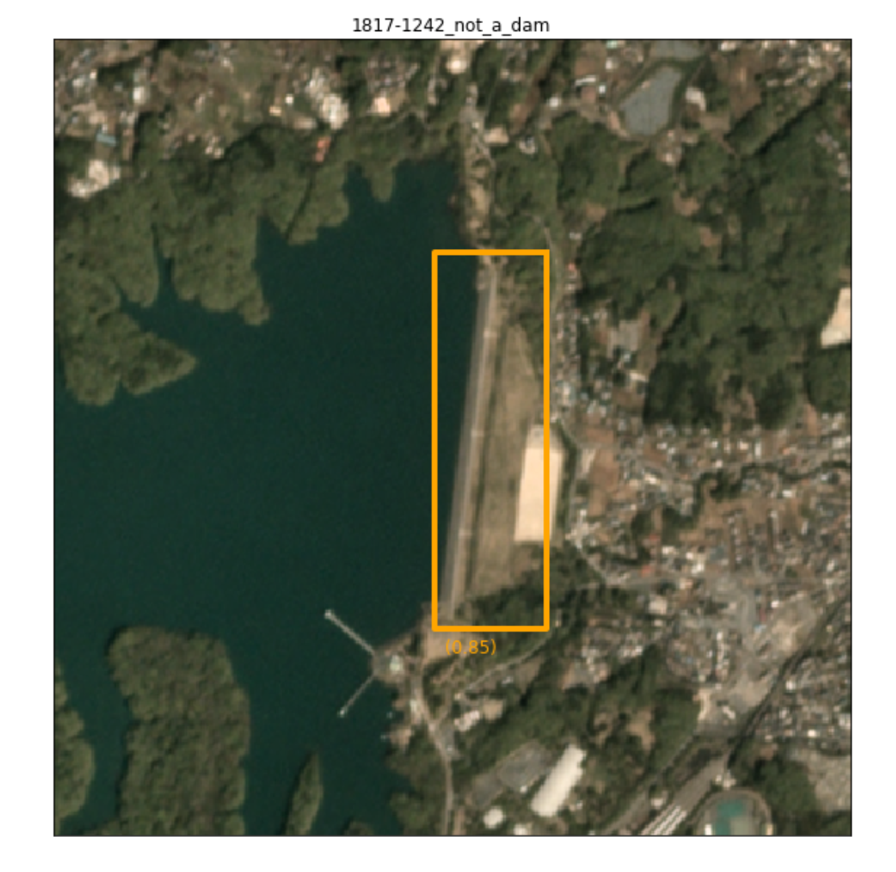
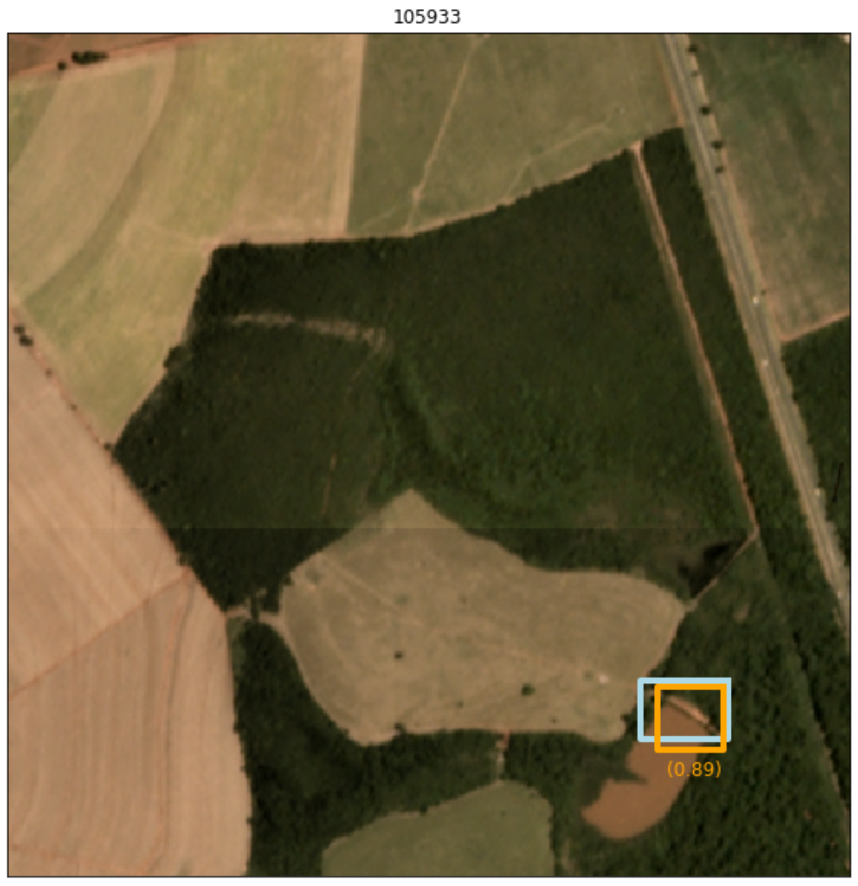

This repo contains the work in progress Deep Learning part of [NatCap](https://naturalcapitalproject.stanford.edu/)'s *Detecting Dams with AI and Satellite Imagery* project. 
It is funded by the National Geographic and Microsoft AI for Earth program. 

# Imagery
See https://bitbucket.org/natcap/extract-dams/src/default/

# Training

See readme in [dams/tfod/training/](https://github.com/charlottegiseleweil/dams/tree/master/tfod/training)
```
python model_train.py --logtostderr --train_dir=training/ --pipeline_config_path=training/{{CONFIG FILE}}.config
```

# Inference

1) Export frozen graph with [dams/tfod/detection/export\_inference_graph.py](https://github.com/charlottegiseleweil/dams/tree/master/tfod/detection)
```
python export_inference_graph.py \
    --input_type image_tensor \
    --pipeline_config_path ../../../../repos/dams/tfod/training/configs/07_29_imagery7-25_Faster_rcnn_resnet50_coco.config \
    --trained_checkpoint_prefix ../../../../outputs/fasterRCNN_07_27_newimagery/model.ckpt-300000 \
    --output_directory ../../../../outputs/fasterRCNN_07_27_newimagery/export_inference \
    --write_inference_graph True
```

2) Run detector [inference.py](https://github.com/charlottegiseleweil/dams/tree/master/tfod/detection/inference.py)
```
python inference.py
          --modelFile {path_to_frozen_graph.pb} 
          --imgDir {path_to_dir}
          --outputDir {path_to_dir}
          --bbox_format (Optional) {outputs bboxes format. Default is y1x1y2x2_pixel}
          --confidenceThreshold (Optional) writes only bboxes above this threshold. Default to 0.05
          --max_boxes_per_images (Optional) {int} Will write this # of bboxes per image. Default to 1
```


Playground/Visualize inference on a few images: [Inference notebook](https://github.com/charlottegiseleweil/dams/blob/master/tfod/detection/Inference.ipynb)


# Evaluation
See [Evaluation notebook](https://github.com/charlottegiseleweil/dams/blob/master/evaluation/Evaluation.ipynb)

1) Store results table (a row per image), with [Write\_results_csv.py](https://github.com/charlottegiseleweil/dams/blob/master/evaluation/Write_results_csv.py)

2) Calculate custom [Evaluation metric](https://github.com/charlottegiseleweil/dams/blob/master/evaluation/evaluation_utils.py): 

  * Recall @ IoU 5% and Confidence > 0.1.
  *  for _Small Dams_ (bbox 500-1800 pixels, i.e dam of ~meters)

3) [Visualize](https://github.com/charlottegiseleweil/dams/blob/master/evaluation/viz_utils.py) images (to analyze mistakes etc..)

4) Human baseline performance

_____
# Samples






______
### Other experiments 
##### Single shot detectors (YOLOv3 with Darknet)
See [dams/experimental/yolov3/readme_ultralytics.md](https://github.com/charlottegiseleweil/dams/blob/master/experimental/yolov3/readme_ultralytics.md)
